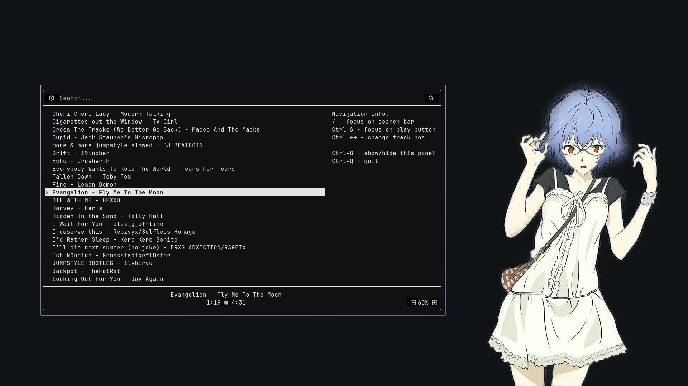

<h1 align="center">🌧️Rain - Simple TUI player🎵</h1>

    
    
    

> It's just my C++ thesis, so it's not even beta, i guess. Rain is still in development and may contain a bunch of bugs. So... don't worry about that. Just report me about them, k.? :3

    <h1 align="center">About</h1>
    
<b>Rain - is a TUI player based on mpv.</b> It can play locally downloaded tracks in a folder, but tracks from Spotify and later SoundCloud will be added soon!

    
and.. of course, it's absolutely free!

<h2 align="center">What can it do?</h2>

in fact, just the <b>basic things:</b>

| Feauture             |done?|                                                  descibtion |
|:---------------------|:---:|------------------------------------------------------------:|
| Play/Pause track     | ✅  |                                             It was not hard |
| Change track volume  | ✅  |                                It's very usefull for me btw |
| Change track pos     | ✅  |                   Idk, it's not hard to made like first two |
| Search track         | ✅  |             It was SO hard to make this at the first moment |
| Spotify tracks       | 🛠️  | I made a functions, but I haven't used them in the code yet |
| SoundCloud tracks    | ❌  |                               It will be in the soon future |
| Offline playback     | ❌  |     I need to make Spotify and SoundCloud tracks work first |

