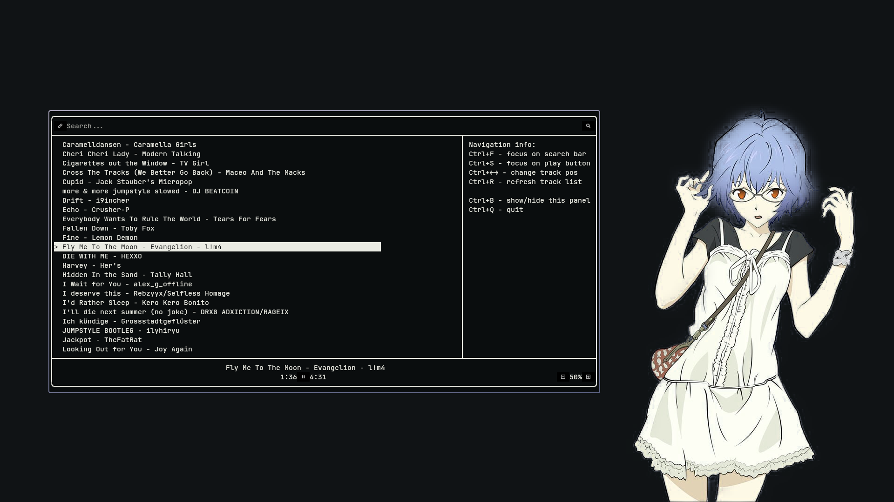

<h1 align="center">🌧️Rain - Simple TUI player🎵</h1>
<p align="center" style="border: 3px solid white; border-radius:15px;padding: 15px 0 8px;">
    <a href="https://t.me/musdev" style="margin-right:5px;">
        
    </a>
    <a href="https://discord.com/users/870324942166716487" style="margin-right:5px;">
        
    </a>
    <a href="https://github.com/musdev13" style="margin-right:5px;">
        
    </a>
    <a href="https://musdev13.github.io/rain/">
        
    </a>
</p>



<div align="center">

> It's just my C++ thesis💻, so it's not even beta, I guess. Rain is still in development and may contain a bunch of bugs🐛 So... don't worry about that. Just report me about them, k.? :3
</div>

<div align="center", style="border: 3px solid white; border-radius:15px;padding:10px 20px">
    <h1 align="center">About</h1>
    <p><b>Rain🌧️ — is a TUI player based on mpv</b>. It can play locally downloaded tracks in a folder and Spotify/Soundcloud☁️/YTMusic tracks</p>
    <p>And... of course, it's absolutely free!💖</p>


<h2 align="center">What can it do?</h2>
<p align="center">in fact, just the <b>basic things</b>:</p>

<div align="center">

| Feauture             |done?|                                                  descibtion |
|:---------------------|:---:|------------------------------------------------------------:|
| Play/Pause track     | ✅  |                                                Pause/Resume |
| Change track volume  | ✅  |                                             +/- track voume |
| Change track pos     | ✅  |                                     Changing track position |
| Search track in list | ✅  |                          Simple track searching in playlist |
| Local tracks         | ✅  |                         Something like .mp3 can be playable |
| Spotify tracks       | ✅  |                           Tracks from Spotify(not directly) |
| Track caching        | ✅  |           Online tracks can be cached for offline listening |
| SoundCloud tracks    | ✅  |                                      Tracks from SoundCloud |
| YouTube Music tracks | ✅  |                                    Tracks from YouTube Music|
| Search Tracks online | 🛠️  |                         Search online tracks by name in app |
| Import from playlist | ❌  | Import tracks from playlists from Spotify, Soundcloud, etc. |
| Windows Version      | ❌  |                          Source code and Binary for Windows |

</div>
</div>

<div align="center" style="border: 3px solid white; border-radius:15px;padding:10px 20px;margin-top:15px">
<h1>Build</h1>

> Yeah, Rain does not have a binary version yet, but if you want, I'll upload Rain on [AUR](https://wiki.archlinux.org/title/Arch_User_Repository) and [GitHub Releases](https://github.com/musdev13/rain/releases) at release

> Also, there is no Windows version of Rain yet, but the key word here is “yet”

<h2>Dependencies</h2>
<p>I use arch btw, so i can just leave a <b>list of packages</b> you need to install at this moment:</p>

<i>P.S.:It's not a names of packages that pacman use</i>

<ul style="list-style-position: inside; text-align: center; padding-left: 0; font-weight: bold;">
    <li>g++</li>
    <li>make</li>
    <li><a href="https://github.com/ArthurSonzogni/FTXUI">ftxui</a></li>
    <li>libmpv</li>
    <li>taglib</li>
    <li>curl</li>
    <li>yt-dlp</li>
</ul>

> Tell me pls if i forgot to add some library to list

<h2>Actually a building process</h2>

first you need to **clone repo** and **cd into Rain directory**:
```sh
git clone --depth 1 https://github.com/musdev13/rain.git
cd rain
```

Now you can **build Rain using make**:
```sh
make
```
Now you can **install Rain**:
```sh
sudo make install
```

---
> you can install rain binary manually into /usr/bin if you want using cp or mv and chmod
```sh
sudo mv build/rain /usr/bin/
chmod +x /usr/bin/rain
```

</div>

<div align="center" style="border: 3px solid white; border-radius:15px;padding:10px 20px;margin-top:15px">

<h1>How to use</h1>

You need to **run rain** and tell the **path of folder** that contain your tracks

**this path will be your playlist**

>**Warning: folder must contain only your tracks and nothing else**

```sh
rain /path/to/playlist/folder
```

**Rain will create a playlist file** in the folder, which will **contain a list of the tracks** in the folder.

You **can change the track order** to your own **in this file**.

> changes will be applied after refresh

If you later add the track to a folder, Rain will **automatically add the file to the list** on startup

---

<h2>Online Tracks</h2>

You can add **online tracks**(Spotify/Soundcloud, etc...) by url **at top-left corner**.

Or you can add track **manualy in playlist file**.

<h3>Spotify Tracks</h3>

You can add spotify track into **playlist file** by adding this line:
```playlist
@rain:spotify\TrackID
```

**example**:

<p>https://open.spotify.com/track/<b>2GlV9w8oHSQdiPPk9lxqlp</b>?si=...</p>

```playlist
@rain:spotify\2GlV9w8oHSQdiPPk9lxqlp
```

<h3>Soundcloud Tracks</h3>

**YOU NEED TO FIND YOUR ClientID AND PUT IT IN `~/.config/rain/SCCID`**

You can add soundcloud track into **playlist file** by adding this line:
```playlist
@rain:soundcloud\arist/track
```

**example**:

<p>https://soundcloud.com/<b>hdhdhd-hdhdhdh-796366279/mashinistam</b>?si=...</p>

```playlist
@rain:soundcloud\hdhdhd-hdhdhdh-796366279/mashinistam
```

<h3>YouTube Music Tracks</h3>

You can add YTMusic track into **playlist file** by adding this line:
```playlist
@rain:ytm\trackid
```

**example**:

<p>https://music.youtube.com/watch?v=<b>9nd5SThcLWE</b>&si=...</p>

```playlist
@rain:ytm\9nd5SThcLWE
```

<h2>Navigation</h2>

on startup, **a panel that explains the hotkeys will open on the right side** of the window

**here's the hotkeys:**

| hotkey |                       action |
|:-------|:----------------------------:|
| Ctrl+F |          focus on search bar |
| Ctrl+S | focus on pause/resume button |
| Ctrl+↔ |        change track position |
| Ctrl+R |           refresh track list |
| Ctrl+B |         show/hide help panel |
| Ctrl+Q |                         quit |

</div>
